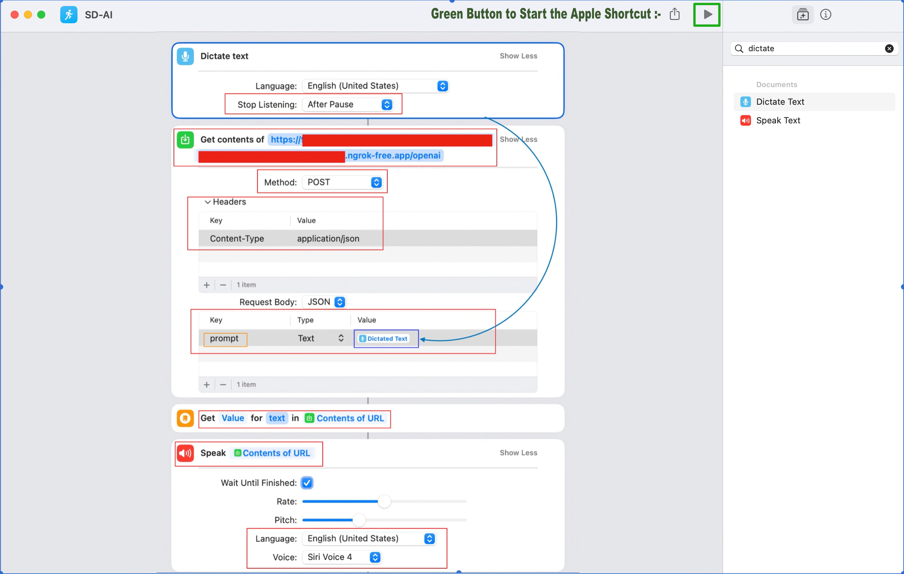

# Enabling OpenAI-based NLP engine with SIRI (MacBook/iPad/iPhone) through a proxy-driven restricted API using Python.


## About this package

This new solution will expose a controlled proxy API built using Python, which enables OpenAI APIs & integrates that with SIRI (One of the world's most popular personal voice assistants). This application developed using Flask, openai, NGROK & other useful libraries. This project is for the advanced Python developer & Data Science Newbi's.


## How to use this package

(The following instructions apply to Posix/bash. Windows users should check
[here](https://docs.python.org/3/library/venv.html).)

First, clone this repository and open a terminal inside the root folder.

Create and activate a new virtual environment (recommended) by running
the following:

```bash
python3 -m venv venv
source venv/bin/activate
```

Install the requirements:

```bash
pip install -r requirements.txt
```

Run the Restricted-API:

```bash
python testJarvis.py
```

Note down the port number, which will be generated as output.

Run the Proxy:

```bash
ngrok http http://<IP_Address from previous steps>:5000
```

Make sure, the port number has to be same as displayed in the first steps.

Now, run the Apple Shortcuts as shown below -



Please find the some of the important dependent package -

```
Flask==2.3.2
python-dateutil==2.8.2
numpy==1.24.3
openai==0.27.7
openapi-schema-pydantic==1.2.4
packaging==23.1
pandas==2.0.1
requests==2.31.0

```

Install the above requirements.

Note that the debug indicator is set to "Y". This will generate logs. If you change this to 'N'. No logs will be generated. However, the process will be faster.

## Screenshots


## Resources

- To view the complete demo with sound, check out our [YouTube Page](https://youtu.be/xQW82Uy1OgA).
- To view on Python, check out the [Python Page](https://docs.python.org/3/).
- To view more on the OpenAI, check out this [OpenAI Official Page](https://platform.openai.com/examples).
- To view more on the ngrok, check out this [NGROK Official Page](https://ngrok.com/docs).
